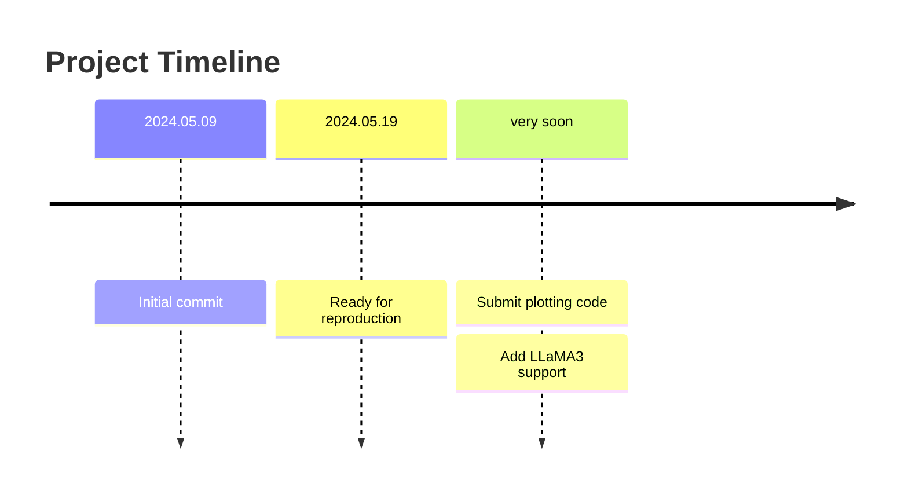

# Supervised LLM Uncertainty Estimation & Quantification

This paper contains all the code used in the paper: "Uncertainty Estimation and Quantification for LLMs: A Simple Supervised Approach".

See the paper for more details: https://arxiv.org/abs/2404.15993.

## Usage

0. Clone the repository to your local machine.
1. Prepare the environment with conda: `conda env create -f environment.yaml`.
2. Use `python main.py` to prepare the data and run the main experiments. We recommend running in the following order:
    - prepare-data: download all the raw datasets used in our experiment; note that users from China mainland may have to use huggingface mirror / proxy to make it work.
    - prepare-model: prepare the pre-trained models used in our experiment.
    - generate-ds: generate the supervised dataset described in our paper; note that this step may take a long time to complete.
    - train-supervised: train the supervised uncertainty estimation model.
    - eval-supervised: evaluate the supervised uncertainty estimation model.
    - prepare-crossmodel: prepare the cross-model uncertainty estimation experiments.
    - eval-crossmodel: evaluate the cross-model uncertainty estimation experiments.

Feel free to report your issues or ask for help on the issues page.
    
## Note

1. As a reference, we run our code on a Ubuntu 22.04-LTS server with 128 CPU cores, 256 GB memory, and 4 Nvidia RTX A6000 GPUs. Our experiments do not introduce extra computational overhead, so please refer to the official documentation for minimum system requirements.
2. The `run.py` is a wrapper script for quickly repreducing the main experiments in our paper. You can also run the extra experiments in the appendix by directly running the corresponding modules.